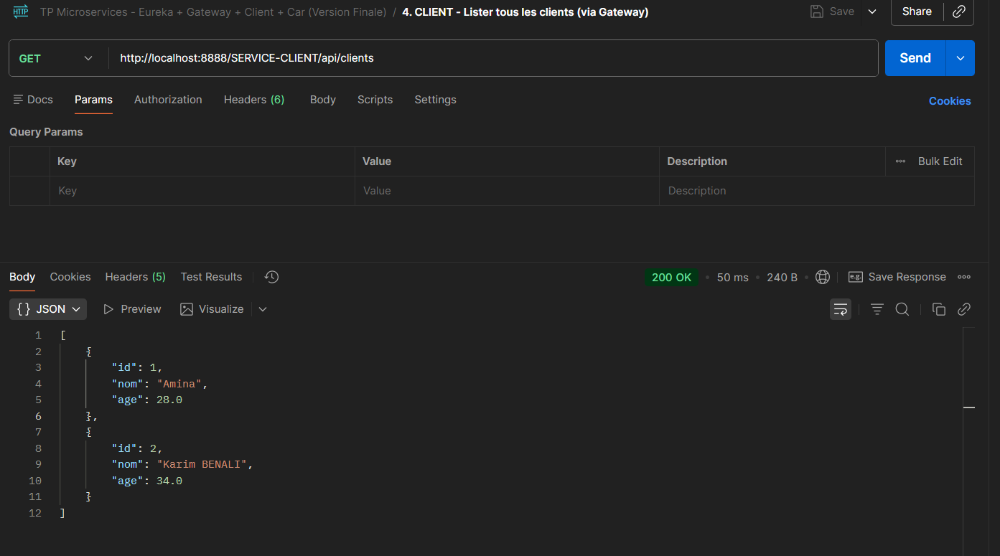
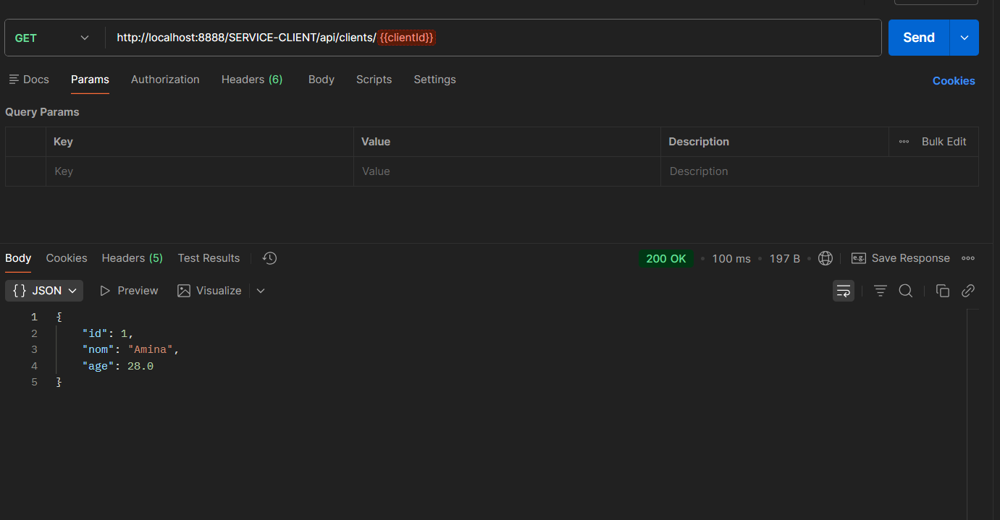
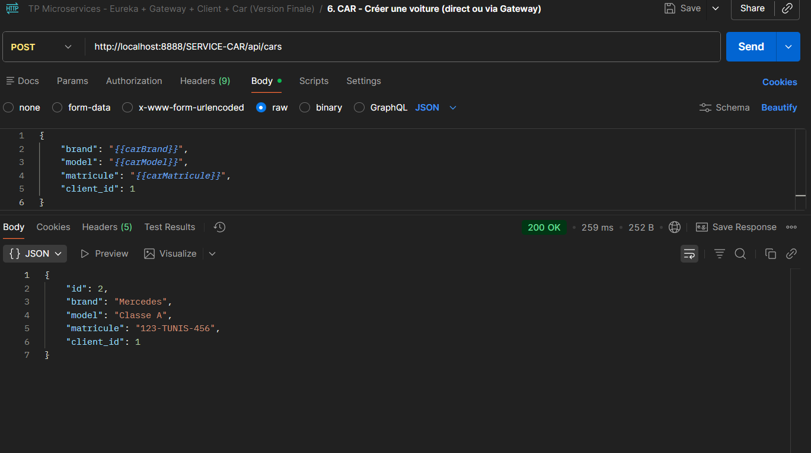
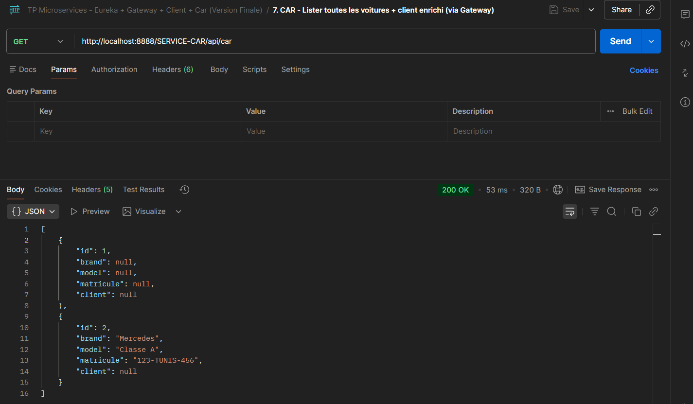

# 🚀 Spring Cloud Microservices - Eureka + Gateway + OpenFeign

Architecture de microservices avec **Spring Cloud** démontrant la découverte de services, le routage API Gateway, et la communication inter-services via OpenFeign.

## 📸 Screenshots






## 🏗️ Architecture

```
Client Web/Mobile
       │
       ▼
   Gateway (8888) → Discovery Locator
       │
       ▼
┌──────────────┐      ┌──────────────┐
│ SERVICE-     │      │ SERVICE-     │
│ CLIENT       │◄─────│ VOITURE      │
│ (8088)       │      │ (8089)       │
└──────────────┘      └──────────────┘
       │                     │
       └──── Eureka (8761) ──┘
```

## ✨ Fonctionnalités

- 🔍 **Service Discovery** - Eureka Server
- 🌐 **API Gateway** - Spring Cloud Gateway (Reactive)
- ⚖️ **Load Balancing** - Client-side avec Spring Cloud LoadBalancer
- 🔗 **Inter-service Communication** - OpenFeign
- 🎯 **Zero-config Routing** - Auto-discovery via Gateway
- 📊 **Health Checks** - Spring Boot Actuator

## 🛠️ Stack Technique

- **Spring Boot 3.3.4** + Java 17
- **Spring Cloud 2025.0.0** (Kilburn)
- **Eureka** - Service Registry
- **Spring Cloud Gateway** - API Gateway
- **OpenFeign** - HTTP Client
- **H2 Database** - Base en mémoire

## 🚀 Démarrage

```bash
# Démarrer les services (dans l'ordre)
./mvnw spring-boot:run -f eureka-server/
./mvnw spring-boot:run -f service-client/
./mvnw spring-boot:run -f service-voiture/
./mvnw spring-boot:run -f gateway/

# Accéder au dashboard Eureka
open http://localhost:8761
```

## 🔗 Endpoints

| URL                         | Description                  |
| --------------------------- | ---------------------------- |
| `GET /clients`              | Liste des clients            |
| `GET /clients/{id}`         | Client par ID                |
| `GET /voitures`             | Voitures avec client enrichi |
| `GET /voitures/{id}`        | Voiture + propriétaire       |
| `GET /voitures/client/{id}` | Voitures d'un client         |
| `http://localhost:8761`     | Eureka Dashboard             |

**Base URL Gateway**: `http://localhost:8888`

## ⚡ Exemple de Réponse

```json
GET /voitures/1
{
  "id": 1,
  "marque": "Toyota",
  "model": "Corolla",
  "client": {
    "id": 1,
    "nom": "Rabab SELIMANI",
    "age": 23
  }
}
```

## 🎯 Scaling

```bash
# Lancer plusieurs instances
java -jar service-client.jar --server.port=8088
java -jar service-client.jar --server.port=8090
java -jar service-client.jar --server.port=8091

# → Load balancing automatique via Gateway
```
